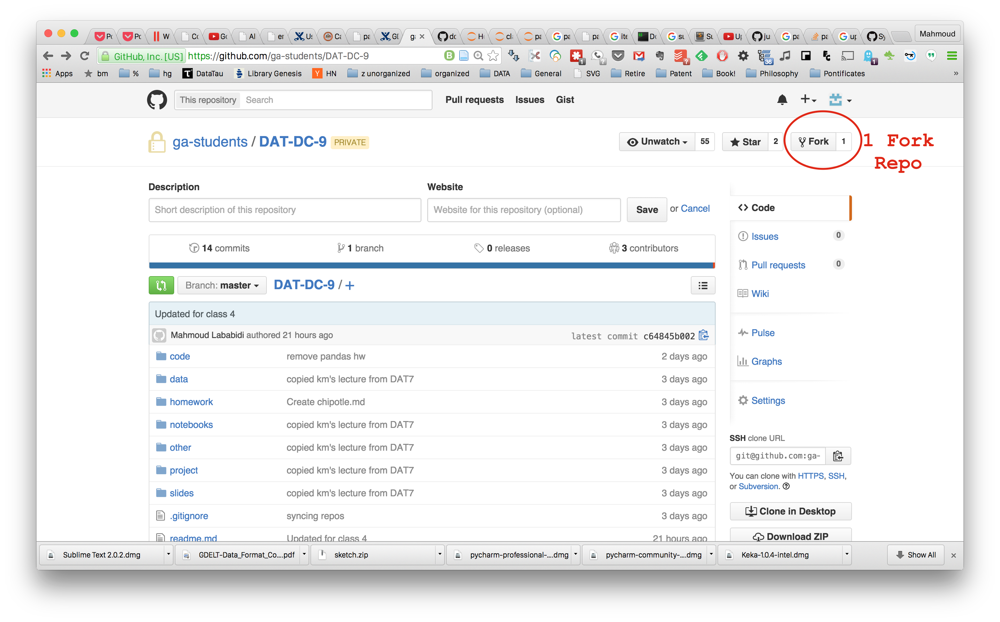
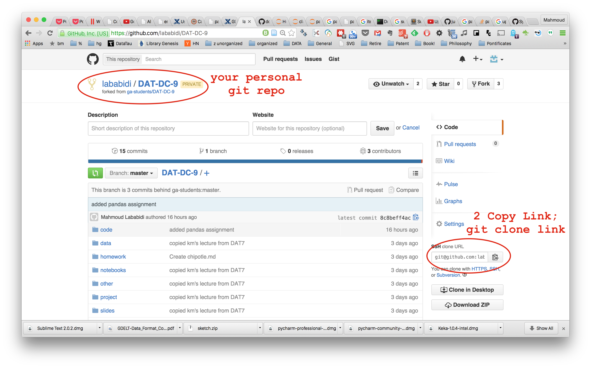

# DAT11 Course Repository
Welcome to Data Science at General Assembly! This is where we will be hosting all class slides, assignments, resources, and more.
Course materials for [General Assembly's Data Science course](https://generalassemb.ly/education/data-science/washington-dc/) in Washington, DC (1/12/16 - 3/31/16).

* Instructors: [Aleks Ontman](https://www.linkedin.com/in/aleksontman?authType=NAME_SEARCH&authToken=v3gt&locale=en_US&trk=tyah&trkInfo=clickedVertical%3Amynetwork%2CclickedEntityId%3A8126156%2CauthType%3ANAME_SEARCH%2Cidx%3A1-5-5%2CtarId%3A1453087892486%2Ctas%3Aale) 
& [Alex Sherman](https://www.linkedin.com/in/alexjmsherman)
* TA: [Al Johri](https://www.linkedin.com/in/aljohri)
 

### Course Outline (tentative, subject to change)
Tuesday | Thursday
--- | ---
1/12: Introduction to Data Science | 1/14: Python Data Model; Data Reading and Cleaning
1/19: Command Line and Version Control | 1/21: Exploratory Data Analysis
1/26: Data Visualization | 1/28: Machine Learning Introduction
2/2: K-Nearest Neighbors  | 2/4: Linear Regression
2/9: Web Scraping and Data Cleansing | 2/11: Basic Model Evaluation
2/16: Logistic Regression | 2/18: Advanced Model Evaluation
2/23: First Project Presentation | 2/25: Naive Bayes and Text Data
3/1: Natural Language Processing | 3/3: Kaggle Competition 
3/8: Decision Trees | 3/10: Ensembling (Random Forest)
3/15: Advanced scikit-learn/Clustering  | 3/17: Final Project Presentation
3/22: Final Project Presentation  | 3/24: Selected Topics, Wrap-up

### Class Assignment Outline (tentative, subject to change)
Date | Assignment
--- | ---
1/21 | HW#1: [Chipotle Python](homework/02_python_homework_chipotle.py)
1/26 | HW#2: [Command Line](homework/03_command_line_chipotle.md)
1/28 | HW#3: [IMDB with Pandas](homework/05_pandas_homework_imdb.ipynb)
2/4  | **Project Brainstorming Deadline**
2/9  | HW#4  Yelp Votes Linear Regression
2/11 | **Project Question and Dataset Due** 
2/16 | HW#5: Web Scraping - IMDB (Optional)
2/23 | **First Project Presentation**
3/8  | HW#6: Naive Bayes with Yelp Review Text (Optional) & **Draft Project Paper Due**
3/15 | **Peer Review Due**
3/22 | Final Project Presentations

### Submission Forms
* [Feedback form](http://goo.gl/forms/ZnPh5X7nPY)
* [Homework Submission form](http://goo.gl/forms/253Yb8rdEI)

-----

### Class 1: Introduction to Data Science
* Welcome from General Assembly staff
* Course overview ([slides](slides/01_course_overview.pdf))
* Introduction to data science ([slides](slides/01_intro_to_data_science.pdf))
* Types of data ([slides](slides/01_types_of_data.pdf))
* Data science tools ([slides](slides/DataScienceTools.pdf))
* [Doing Data Science at Twitter](http://bit.ly/1Fs08QC)
* [17 types of data science](http://www.datasciencecentral.com/profiles/blogs/17-analytic-disciplines-compared)
* The Python Data Model
* Wrap up: Slack tour, feedback form

### Python Resources
* [Codecademy's Python course](http://www.codecademy.com/en/tracks/python): Good beginner material, including tons of in-browser exercises.
* [DataQuest](https://dataquest.io/): Similar interface to Codecademy, but focused on teaching Python in the context of data science.
* [Google's Python Class](https://developers.google.com/edu/python/): Slightly more advanced, including hours of useful lecture videos and downloadable exercises (with solutions).
* [A Crash Course in Python for Scientists](http://nbviewer.ipython.org/gist/rpmuller/5920182): Read through the Overview section for a quick introduction to Python.
* [Python for Informatics](http://www.pythonlearn.com/book.php): A very beginner-oriented book, with associated [slides](https://drive.google.com/folderview?id=0B7X1ycQalUnyal9yeUx3VW81VDg&usp=sharing) and [videos](https://www.youtube.com/playlist?list=PLlRFEj9H3Oj4JXIwMwN1_ss1Tk8wZShEJ).
* [Beginner](code/00_python_beginner_workshop.py) and [intermediate](code/00_python_intermediate_workshop.py) workshop code: Useful for review and reference.
* [Python Tutor](http://pythontutor.com/): Allows you to visualize the execution of Python code.

**Resources:**
* For a useful look at the different types of data scientists, read [Analyzing the Analyzers](http://cdn.oreillystatic.com/oreilly/radarreport/0636920029014/Analyzing_the_Analyzers.pdf) (32 pages).
* For some thoughts on what it's like to be a data scientist, read these short posts from [Win-Vector](http://www.win-vector.com/blog/2012/09/on-being-a-data-scientist/) and [Datascope Analytics](http://datascopeanalytics.com/what-we-think/2014/07/31/six-qualities-of-a-great-data-scientist).
* Quora has a [data science topic FAQ](https://www.quora.com/Data-Science) with lots of interesting Q&A.
* Keep up with local data-related events through the Data Community DC [event calendar](http://www.datacommunitydc.org/calendar) or [weekly newsletter](http://www.datacommunitydc.org/newsletter).
* [Data Science vs Statistics](http://bit.ly/1FrZX80)
* [15 Books every Data Scientist Should Read](http://bit.ly/1Fs0bvW)
* [50+ Free Data Science Books](http://bit.ly/1Fs0kzr)
* [FREE BOOK:](http://www-bcf.usc.edu/~gareth/ISL/) Introduction to Statistical Learning
* [Building Data Science Teams](http://oreil.ly/1G1s6Oc)
* [R for Everyone:](http://amzn.to/1MHKPpR) Great reference for R
* [Doing Data Science](http://amzn.to/1MHM1Jz)
* [Python for Data Analysis](http://amzn.to/1JomygU)
* [Getting Started with Data Science](http://treycausey.com/getting_started.html)

---

### Class 2: Python Fundamentals, Data Reading, and Cleaning
* Python:
    * Spyder interface / Ipython Notebooks
    * Looping exercise
    * Lesson on file reading with airline safety data ([code](code/02_file_reading.py), [data](data/airlines.csv), [article](http://fivethirtyeight.com/features/should-travelers-avoid-flying-airlines-that-have-had-crashes-in-the-past/))
    * Data cleaning exercise
    * Walkthrough of Python homework with Chipotle data ([code](homework/02_python_homework_chipotle.py), [data](data/chipotle.tsv), [article](http://www.nytimes.com/interactive/2015/02/17/upshot/what-do-people-actually-order-at-chipotle.html))
* Discuss Course Project
* Wrap up: Course schedule, office hours

**Homework:**
* Complete the [Python homework assignment](homework/02_python_homework_chipotle.py) with the Chipotle data, add a commented Python script to your GitHub repo, and submit a link using the homework submission form. (**Note:** Pandas, which is covered in class 4, should not be used for this assignment.)

* Review the code from the [beginner](code/00_python_beginner_workshop.py) and [intermediate](code/00_python_intermediate_workshop.py) Python workshops. 
If you don't feel comfortable with any of the content (excluding the "requests" and "APIs" sections), you should spend some time this weekend practicing Python:
    * [Introduction to Python](http://introtopython.org/) does a great job explaining Python essentials and includes tons of example code.
    * If you like learning from a book, [Python for Informatics](http://www.pythonlearn.com/html-270/) has useful chapters on strings, lists, and dictionaries.
    * If you prefer interactive exercises, try these lessons from [Codecademy](http://www.codecademy.com/en/tracks/python): "Python Lists and Dictionaries" and "A Day at the Supermarket".
    * If you have more time, try missions 2 and 3 from [DataQuest's Learning Python](https://www.dataquest.io/course/learning-python) course.
    * If you've already mastered these topics and want more of a challenge, try solving [Python Challenge](http://www.pythonchallenge.com/) number 1 (decoding a message) and send me your code in Slack.
* To give you a framework for thinking about your project, watch [What is machine learning, and how does it work?](https://www.youtube.com/watch?v=elojMnjn4kk) (10 minutes). (This is the [IPython notebook](https://github.com/justmarkham/scikit-learn-videos/blob/master/01_machine_learning_intro.ipynb) shown in the video.) Alternatively, read [A Visual Introduction to Machine Learning](http://www.r2d3.us/visual-intro-to-machine-learning-part-1/), which focuses on a specific machine learning model called decision trees.
* **Optional:** Browse through some more [example student projects](https://github.com/justmarkham/DAT-project-examples), which may help to inspire your own project!

* Install the [Anaconda distribution](http://continuum.io/downloads) of Python 2.7x.
    * If you choose not to use Anaconda, here is a list of the [Python packages](other/python_packages.md) you will need to install during the course.

**Resources:**
* [Want to understand Python's comprehensions? Think in Excel or SQL](http://blog.lerner.co.il/want-to-understand-pythons-comprehensions-think-like-an-accountant/) may be helpful if you are still confused by list comprehensions.
* [My code isn't working](http://www.tecoed.co.uk/uploads/1/4/2/4/14249012/624506_orig.png) is a great flowchart explaining how to debug Python errors.
* [PEP 8](https://www.python.org/dev/peps/pep-0008/) is Python's "classic" style guide, and is worth a read if you want to write readable code that is consistent with the rest of the Python community.
* If you want to understand Python at a deeper level: Ned Batchelder's [Loop Like A Native](http://nedbatchelder.com/text/iter.html), [Python Names and Values](http://nedbatchelder.com/text/names1.html), 
Raymond Hettinger's [Transforming Code into Beautiful, Idiomatic Python](https://www.youtube.com/watch?v=OSGv2VnC0go) and [Python Epiphanies](https://www.youtube.com/watch?v=Pi9NpxAvYSs) are excellent presentations.
* [Everything is an object in Python](https://www.jeffknupp.com/blog/2013/02/14/drastically-improve-your-python-understanding-pythons-execution-model/)
* [Nate Silver on the Art and Science of Prediction](https://www.youtube.com/watch?v=eE4qCJBgfIk&index=22&list=LLGUFXF_Wex-mp-gpXFPYZEQ)

-----

### Class 3: Command Line and Version Control
* Git and GitHub ([slides](slides/03_git_github.pdf))
* Command line exercise ([code](code/03_command_line.md))
* Intermediate command line

**Homework:**
* Work through GA's friendly [command line tutorial](http://generalassembly.github.io/prework/command-line/#/) using Terminal (Linux/Mac) or Git Bash (Windows), and then browse through this [command line reference](code/03_command_line.md).
* Watch videos 1 through 8 (21 minutes) of [Introduction to Git and GitHub](https://www.youtube.com/playlist?list=PL5-da3qGB5IBLMp7LtN8Nc3Efd4hJq0kD).

Create a Markdown document that includes your answers to questions 1-3 below and the code you used to arrive at those answers. 
Add this file to a GitHub repo that you'll use for all of your coursework, and submit a link to your repo using the homework submission form:
* Complete the [command line homework assignment](homework/03_command_line_chipotle.md) with the Chipotle data.

1. Using `chipotle.tsv` in the `data` subdirectory:
    * Look at the head and the tail, and think for a minute about how the data is structured. What do you think each column means? What do you think each row means? Tell me! (If you're unsure, look at more of the file contents.)
    * How many orders do there appear to be?
    * How many lines are in the file?
    * Which burrito is more popular, steak or chicken?
    * Do chicken burritos more often have black beans or pinto beans?
2. Count the number of occurrences of the word 'dictionary' (regardless of case) across all files in the DAT9 repo.
3. **Optional:** Use the the command line to discover something "interesting" about the Chipotle data. The [advanced commands](code/03_command_line.md#Advanced-commands) may be helpful to you!

**Git and Markdown Resources:**
* [Pro Git](http://git-scm.com/book/en/v2) is an excellent book for learning Git. Read the first two chapters to gain a deeper understanding of version control and basic commands.
* [How to remove .DS_Store from GitHub](https://gist.github.com/vybstat/1680bef4715bfbcb0268)
* [GitHub for Beginners](http://readwrite.com/2013/09/30/understanding-github-a-journey-for-beginners-part-1)
* If you want to practice a lot of Git (and learn many more commands), [Git Immersion](http://gitimmersion.com/) looks promising.
* If you want to understand how to contribute on GitHub, you first have to understand [forks and pull requests](http://www.dataschool.io/simple-guide-to-forks-in-github-and-git/).
* [GitRef](http://gitref.org/) is my favorite reference guide for Git commands, and [Git quick reference for beginners](http://www.dataschool.io/git-quick-reference-for-beginners/) is a shorter guide with commands grouped by workflow.
* [Markdown Cheatsheet](https://github.com/adam-p/markdown-here/wiki/Markdown-Cheatsheet) provides a thorough set of Markdown examples with concise explanations. GitHub's [Mastering Markdown](https://guides.github.com/features/mastering-markdown/) is a simpler and more attractive guide, but is less comprehensive.
* [Introducing GitHub](http://amzn.to/1KCjWg6) is a nice intro to GitHub that reads quickly
* [Version Control with Git](http://amzn.to/1gSkBm2)
* [Cracking the Code to GitHub's Growth](https://growthhackers.com/growth-studies/github) explains why GitHub is so popular among developers.

**Command Line Resources:**
* [The Linux command line](http://courseweb.pitt.edu/bbcswebdav/institution/Pitt%20Online/MLIS_Pitt_Online/LIS%202600/Intro%20Module/LIS_2600_%20M1_Shotts%202009.pdf)
* If you want to go much deeper into the command line, [Data Science at the Command Line](http://amzn.to/1gSjcvV) is a great book. 
The [companion website](http://datascienceatthecommandline.com/) provides installation instructions for a "data science toolbox" 
(a virtual machine with many more command line tools), as well as a long reference guide to popular command line tools.
* If you want to do more at the command line with CSV files, try out [csvkit](http://csvkit.readthedocs.org/), which can be installed via `pip`.

----
### Git Repo setup
#### Step 1
Fork the Class repo:

#### Step 2
Copy the link from your new Forked Repo

#### Step 3
Clone your new forked repo to your computer.
```git clone git@github.com:YOUR_USERNAME/DAT-DC-11.git```
#### Step 4
cd (change directory) into the cloned repo.
#### Step 5
```git remote add upstream https://github.com/ga-students/DAT-DC-11```
#### Step 6
Repeat this step often to keep your Repo up to date with the Class Repo:

    git fetch upstream
    git merge upstream/master

**Resources:**
* Watch [Syncing Your GitHub Fork](https://www.youtube.com/watch?v=-zvHQXnBO6c) to learn more about GitHub forks
* or read [Simple guide to forks in GitHub and Git](http://www.dataschool.io/simple-guide-to-forks-in-github-and-git/)

-----

### Class 4: Exploratory Data Analysis
* Pandas ([code](code/04_pandas.py)):
    * MovieLens 100k movie ratings ([data](data/u.user), [data dictionary](http://files.grouplens.org/datasets/movielens/ml-100k-README.txt), [website](http://grouplens.org/datasets/movielens/))
    * Alcohol consumption by country ([data](data/drinks.csv), [article](http://fivethirtyeight.com/datalab/dear-mona-followup-where-do-people-drink-the-most-beer-wine-and-spirits/))
    * Reports of UFO sightings ([data](data/ufo.csv), [website](http://www.nuforc.org/webreports.html))
* Project question exercise

**Homework:**
* Read [How Software in Half of NYC Cabs Generates $5.2 Million a Year in Extra Tips](http://iquantny.tumblr.com/post/107245431809/how-software-in-half-of-nyc-cabs-generates-5-2) for an excellent example of exploratory data analysis.
* Read [Anscombe's Quartet, and Why Summary Statistics Don't Tell the Whole Story](http://data.heapanalytics.com/anscombes-quartet-and-why-summary-statistics-dont-tell-the-whole-story/) for a classic example of why visualization is useful.
<!-- * Use the Chipotle Data in PANDAS and come up with some results to a few questions that weren't asked before. (i.e. how many soda drinkers like guacamole?) -->

**Resources:**
* Browsing or searching the Pandas [API Reference](http://pandas.pydata.org/pandas-docs/stable/api.html) is an excellent way to locate a function even if you don't know its exact name.
* [What I do when I get a new data set as told through tweets](http://simplystatistics.org/2014/06/13/what-i-do-when-i-get-a-new-data-set-as-told-through-tweets/) is a fun (yet enlightening) look at the process of exploratory data analysis.

----
### Class 5: Visualization
* Part 2 of Exploratory Data Analysis with Pandas ([code](code/04_pandas.py))
* Visualization with Pandas and Matplotlib ([notebooks](notebooks/05_pandas_visualization.ipynb))
* Python homework with the Chipotle data ([Solution](homework solutions/03_python_homework_chipotle_explained.ipynb))

**Homework:**
* Complete the [Pandas homework assignment](homework/05_pandas_homework_imdb.ipynb) with the [IMDb data](data/imdb_1000.csv). 

**Pandas Resources:**
* To learn more Pandas, read this [three-part tutorial](http://www.gregreda.com/2013/10/26/intro-to-pandas-data-structures/), 
or review these two excellent (but extremely long) notebooks on Pandas: 
[introduction](https://github.com/fonnesbeck/Bios8366/blob/master/notebooks/Section2_5-Introduction-to-Pandas.ipynb) and 
[data wrangling](https://github.com/fonnesbeck/Bios8366/blob/master/notebooks/Section2_6-Data-Wrangling-with-Pandas.ipynb).
* If you want to go really deep into Pandas (and NumPy), read the book [Python for Data Analysis](http://shop.oreilly.com/product/0636920023784.do), written by the creator of Pandas.
* This notebook demonstrates the different types of [joins in Pandas](notebooks/05_pandas_merge.ipynb), for when you need to figure out how to merge two DataFrames.
* This is a nice, short tutorial on [pivot tables](https://beta.oreilly.com/learning/pivot-tables) in Pandas.

**Visualization Resources:**
* [Harvard's Data Science course](http://cs109.github.io/2014/) includes an excellent lecture on [Visualization Goals, Data Types, and Statistical Graphs](http://cm.dce.harvard.edu/2015/01/14328/L03/screen_H264LargeTalkingHead-16x9.shtml) (83 minutes), for which the [slides](https://docs.google.com/file/d/0B7IVstmtIvlHLTdTbXdEVENoRzQ/edit) are also available.
* Watch [Look at Your Data](https://www.youtube.com/watch?v=coNDCIMH8bk) (18 minutes) for an excellent example of why visualization is useful for understanding your data.
* For more on Pandas plotting, read this [notebook](https://github.com/fonnesbeck/Bios8366/blob/master/notebooks/Section2_7-Plotting-with-Pandas.ipynb) or the [visualization page](http://pandas.pydata.org/pandas-docs/stable/visualization.html) from the official Pandas documentation.
* To learn how to customize your plots further, browse through this [notebook on matplotlib](https://github.com/fonnesbeck/Bios8366/blob/master/notebooks/Section2_4-Matplotlib.ipynb) or this [similar notebook](https://github.com/jrjohansson/scientific-python-lectures/blob/master/Lecture-4-Matplotlib.ipynb).
* Read [Overview of Python Visualization Tools](http://pbpython.com/visualization-tools-1.html) for a useful comparison of Matplotlib, Pandas, Seaborn, ggplot, Bokeh, Pygal, and Plotly.
* To explore different types of visualizations and when to use them, [Choosing a Good Chart](http://extremepresentation.typepad.com/files/choosing-a-good-chart-09.pdf) and [The Graphic Continuum](http://www.coolinfographics.com/storage/post-images/The-Graphic-Continuum-POSTER.jpg) are nice one-page references, and the interactive [R Graph Catalog](http://shiny.stat.ubc.ca/r-graph-catalog/) has handy filtering capabilities.
* This [PowerPoint presentation](http://www2.research.att.com/~volinsky/DataMining/Columbia2011/Slides/Topic2-EDAViz.ppt) from Columbia's Data Mining class contains lots of good advice for properly using different types of visualizations.

----

### Class 6: Machine Learning
* Part 2 of Visualization with Pandas and Matplotlib ([notebook](notebooks/05_pandas_visualization.ipynb))
* "Human learning" exercise:
    * [Iris dataset](http://archive.ics.uci.edu/ml/datasets/Iris) hosted by the UCI Machine Learning Repository
    * [Iris photo](http://sebastianraschka.com/Images/2014_python_lda/iris_petal_sepal.png)
    * [Iris exercise Notebook](notebooks/06_human_learning_iris_exercise.ipynb)
    * [Iris answers Notebook](notebooks/06_human_learning_iris.ipynb) available after class ends
* Introduction to machine learning ([slides](slides/06_machine_learning.pdf))

**Homework:**
* **Optional:** For an introduction to linear regression, watch [The Easiest Introduction to Regression Analysis](https://www.youtube.com/watch?v=k_OB1tWX9PM) (14 minutes).
* If you're not using Anaconda, install [requests](http://www.python-requests.org/en/latest/user/install/) and [Beautiful Soup 4](http://www.crummy.com/software/BeautifulSoup/bs4/doc/#installing-beautiful-soup) using `pip`. (Both of these packages are included with Anaconda.)

**Machine Learning Resources:**
* For a very quick summary of the key points about machine learning, watch [What is machine learning, and how does it work?](https://www.youtube.com/watch?v=elojMnjn4kk) (10 minutes) or read the [associated notebook](https://github.com/justmarkham/scikit-learn-videos/blob/master/01_machine_learning_intro.ipynb).
* For a more in-depth introduction to machine learning, read section 2.1 (14 pages) of Hastie and Tibshirani's excellent book, [An Introduction to Statistical Learning](http://www-bcf.usc.edu/~gareth/ISL/). (It's a free PDF download!)
* The [Learning Paradigms](http://work.caltech.edu/library/014.html) video (13 minutes) from [Caltech's Learning From Data course](http://work.caltech.edu/telecourse.html) provides a nice comparison of supervised versus unsupervised learning, as well as an introduction to "reinforcement learning".
* [Real-World Active Learning](https://beta.oreilly.com/ideas/real-world-active-learning) is a readable and thorough introduction to "active learning", a variation of machine learning in which humans label only the most "important" observations.
* For a preview of some of the machine learning content we will cover during the course, read Sebastian Raschka's [overview of the supervised learning process](https://github.com/rasbt/pattern_classification/blob/master/machine_learning/supervised_intro/introduction_to_supervised_machine_learning.md).
* [Data Science, Machine Learning, and Statistics: What is in a Name?](http://www.win-vector.com/blog/2013/04/data-science-machine-learning-and-statistics-what-is-in-a-name/) discusses the differences between these (and other) terms.
* [The Emoji Translation Project](https://www.kickstarter.com/projects/fred/the-emoji-translation-project) is a really fun application of machine learning.
* Look up the [characteristics of your zip code](http://www.esri.com/landing-pages/tapestry/), and then read about the [67 distinct segments](http://doc.arcgis.com/en/esri-demographics/data/tapestry-segmentation.htm) in detail.

**IPython Notebook Resources:**
* If you would like to learn the IPython Notebook, the official [Notebook tutorials](https://github.com/jupyter/notebook/blob/master/docs/source/examples/Notebook/Examples%20and%20Tutorials%20Index.ipynb) are useful.
* This [Reddit discussion](https://www.reddit.com/r/Python/comments/3be5z2/do_you_prefer_ipython_notebook_over_ipython/) compares the relative strengths of the IPython Notebook and Spyder.

-----

### Class 7: K-Nearest Neighbors
* Finish the Iris exercise [Iris answers Notebook](notebooks/06_human_learning_iris.ipynb)
* discuss dataframe iteration approaches [iteration time test](notebooks/07_df_iter_time_test.ipynb)
* K-nearest neighbors and scikit-learn [notebook](notebooks/07_knn_sklearn.ipynb)
* Exercise with NBA player data [notebook](notebooks/07_nba_knn.ipynb), [data](https://github.com/justmarkham/DAT4-students/blob/master/kerry/Final/NBA_players_2015.csv), [data dictionary](https://github.com/justmarkham/DAT-project-examples/blob/master/pdf/nba_paper.pdf))

**Homework:**
* Read [introduction to reproducibility](http://www.dataschool.io/reproducibility-is-not-just-for-researchers/), read Jeff Leek's [guide to creating a reproducible analysis](https://github.com/jtleek/datasharing), and watch this related [Colbert Report video](http://thecolbertreport.cc.com/videos/dcyvro/austerity-s-spreadsheet-error) (8 minutes).
* Optional: If you're not using Anaconda, install Seaborn using pip. If you're using Anaconda, install Seaborn by running conda install seaborn at the command line. (Note that some students in past courses have had problems with Anaconda after installing Seaborn.)
* Work on your project!

**KNN Resources:**
* For a recap of the key points about KNN and scikit-learn, watch [Getting started in scikit-learn with the famous iris dataset](https://www.youtube.com/watch?v=hd1W4CyPX58) (15 minutes) and [Training a machine learning model with scikit-learn](https://www.youtube.com/watch?v=RlQuVL6-qe8) (20 minutes).
* KNN supports [distance metrics](http://scikit-learn.org/stable/modules/generated/sklearn.neighbors.DistanceMetric.html) other than Euclidean distance, such as [Mahalanobis distance](http://stats.stackexchange.com/questions/62092/bottom-to-top-explanation-of-the-mahalanobis-distance), which [takes the scale of the data into account](http://blogs.sas.com/content/iml/2012/02/15/what-is-mahalanobis-distance.html).
* [A Detailed Introduction to KNN](https://saravananthirumuruganathan.wordpress.com/2010/05/17/a-detailed-introduction-to-k-nearest-neighbor-knn-algorithm/) is a bit dense, but provides a more thorough introduction to KNN and its applications.
* This lecture on [Image Classification](http://cs231n.github.io/classification/) shows how KNN could be used for detecting similar images, and also touches on topics we will cover in future classes (hyperparameter tuning and cross-validation).
* Some applications for which KNN is well-suited are [object recognition](http://vlm1.uta.edu/~athitsos/nearest_neighbors/), [satellite image enhancement](http://land.umn.edu/documents/FS6.pdf), [document categorization](http://www.ceng.metu.edu.tr/~e120321/paper.pdf), and [gene expression analysis](http://citeseerx.ist.psu.edu/viewdoc/summary?doi=10.1.1.208.993).

**Seaborn Resources:**
* To get started with Seaborn for visualization, the official website has a series of [detailed tutorials](http://web.stanford.edu/~mwaskom/software/seaborn/tutorial.html) and an [example gallery](http://web.stanford.edu/~mwaskom/software/seaborn/examples/index.html).
* [Data visualization with Seaborn](https://beta.oreilly.com/learning/data-visualization-with-seaborn) is a quick tour of some of the popular types of Seaborn plots.
* [Visualizing Google Forms Data with Seaborn](http://pbpython.com/pandas-google-forms-part2.html) and [How to Create NBA Shot Charts in Python](http://savvastjortjoglou.com/nba-shot-sharts.html) are both good examples of Seaborn usage on real-world data.


-----

### Class 8: Linear Regression
* Machine learning exercise ([article](http://blog.dominodatalab.com/10-interesting-uses-of-data-science/))
* Linear regression ([notebook](notebooks/08_linear_regression.ipynb))
    * [Capital Bikeshare dataset](data/bikeshare.csv) used in a Kaggle competition
    * [Data dictionary](https://www.kaggle.com/c/bike-sharing-demand/data)
* Feature engineering example: [Predicting User Engagement in Corporate Collaboration Network](https://github.com/mikeyea/DAT7_project/blob/master/final%20project/Class_Presention_MYea.ipynb)
* Exploring the bias-variance tradeoff [notebook](notebooks/08_bias_variance.ipynb)

**Homework:**
* Reading assignment on the [bias-variance tradeoff](http://scott.fortmann-roe.com/docs/BiasVariance.html)

**Linear Regression Resources:**
* To go much more in-depth on linear regression, read Chapter 3 of [An Introduction to Statistical Learning](http://www-bcf.usc.edu/~gareth/ISL/). Alternatively, watch the [related videos](http://www.dataschool.io/15-hours-of-expert-machine-learning-videos/) or read my [quick reference guide](http://www.dataschool.io/applying-and-interpreting-linear-regression/) to the key points in that chapter.
* This [introduction to linear regression](http://people.duke.edu/~rnau/regintro.htm) is more detailed and mathematically thorough, and includes lots of good advice.
* This is a relatively quick post on the [assumptions of linear regression](http://pareonline.net/getvn.asp?n=2&v=8).
* Setosa has an [interactive visualization](http://setosa.io/ev/ordinary-least-squares-regression/) of linear regression.
* For a brief introduction to confidence intervals, hypothesis testing, p-values, and R-squared, as well as a comparison between scikit-learn code and [Statsmodels](http://statsmodels.sourceforge.net/) code, read my [DAT7 lesson on linear regression](https://github.com/justmarkham/DAT7/blob/master/notebooks/10_linear_regression.ipynb).
* Here is a useful explanation of [confidence intervals](http://www.quora.com/What-is-a-confidence-interval-in-laymans-terms/answer/Michael-Hochster) from Quora.
* [Hypothesis Testing: The Basics](http://20bits.com/article/hypothesis-testing-the-basics) provides a nice overview of the topic, and John Rauser's talk on [Statistics Without the Agonizing Pain](https://www.youtube.com/watch?v=5Dnw46eC-0o) (12 minutes) gives a great explanation of how the null hypothesis is rejected.
* Earlier this year, a major scientific journal banned the use of p-values:
    * Scientific American has a nice [summary](http://www.scientificamerican.com/article/scientists-perturbed-by-loss-of-stat-tools-to-sift-research-fudge-from-fact/) of the ban.
    * This [response](http://www.nature.com/news/statistics-p-values-are-just-the-tip-of-the-iceberg-1.17412) to the ban in Nature argues that "decisions that are made earlier in data analysis have a much greater impact on results".
    * Andrew Gelman has a readable [paper](http://www.stat.columbia.edu/~gelman/research/unpublished/p_hacking.pdf) in which he argues that "it's easy to find a p < .05 comparison even if nothing is going on, if you look hard enough".
    * [Science Isn't Broken](http://fivethirtyeight.com/features/science-isnt-broken/) includes a neat tool that allows you to "p-hack" your way to "statistically significant" results.
* [Accurately Measuring Model Prediction Error](http://scott.fortmann-roe.com/docs/MeasuringError.html) compares adjusted R-squared, AIC and BIC, train/test split, and cross-validation.

**Other Resources:**
* Section 3.3.1 of [An Introduction to Statistical Learning](http://www-bcf.usc.edu/~gareth/ISL/) (4 pages) has a great explanation of dummy encoding for categorical features.
* Kaggle has some nice [visualizations of the bikeshare data](https://www.kaggle.com/c/bike-sharing-demand/scripts?outputType=Visualization) we used today.

-----


## Meet the Team

### [Aleks Ontman](https://www.linkedin.com/in/aleksontman?authType=NAME_SEARCH&authToken=v3gt&locale=en_US&trk=tyah&trkInfo=clickedVertical%3Amynetwork%2CclickedEntityId%3A8126156%2CauthType%3ANAME_SEARCH%2Cidx%3A1-5-5%2CtarId%3A1453087892486%2Ctas%3Aale) (Instructor)
Dr. Ontman joined Deloitte in 2012, currently a Sr. Data Scientist in Deloitte's Advanced Analytics Visualization team (VizStudio) 
specializing in: machine learning, design thinking for prototyping new solutions, ideation workshops, and guided interactions 
with Big Data. Our projects involved big data solutions for 5+ Fortune 100 companies, 10+ Fortune 500 companies, and several Federal Agencies.

### [Alex Sherman](https://www.linkedin.com/in/alexjmsherman) (Instructor)
Alex is a passionate business analytics advocate. He currently works as a Technology Consultant at Deloitte Consulting, 
in which he leads the design and implementation for informatics and analytics software development projects, 
repurposing semantic open source software to enhance data access for federal health care clients. 
In his free time, Alex is an avid jazz percussionist, self-proclaimed as the best drum stick spinner in the DC metro area.
* Contact Info:
* Email: [alexjmsherman@gmail.com](mailto:alexjmsherman@gmail.com)

### [Al Johri](https://www.linkedin.com/in/aljohri) (TA)

Al is interested in creatively applying software engineering and data science to solve real world problems. 
He recently graduated with a degree in computer science from the McCormick School of Engineering at Northwestern University and 
currently works at the Washington Post as a Data Scientist part of the Big Data & Data Warehouse Solutions department.

### Tim Foley (Course Producer)
As your Course Producer, it's Tim's job to make sure that you (and your instructors) have everything you need for a successful experience in DAT9. **If you've got a question, and you're not sure who to ask, start with Tim!**

Before GA, Tim lived and worked in China as a facilitator and program-designer for youth leadership programs at international schools all over Asia (e.g. student-council retreats, backpacking trips, etc.). After a year abroad, he was ready to move back to the good ol' USA. Tim started out at the front desk as a member of GA's Front Lines team, moved up to "Campus Commander" (yes, a real title), and then in January started as a full-time Course Producer. In addition to Data Science, Tim also produces Front- and Back-End Web Development, Data Analytics, Mobile Development, and Digital Marketing. Tim has been trying to learn Esperanto since high school.

**Contact Info**
* Email: [tim.foley@generalassemb.ly](mailto:tim.foley@generalassemb.ly)
* Phone: 202-748-3694
* and Slack too!
